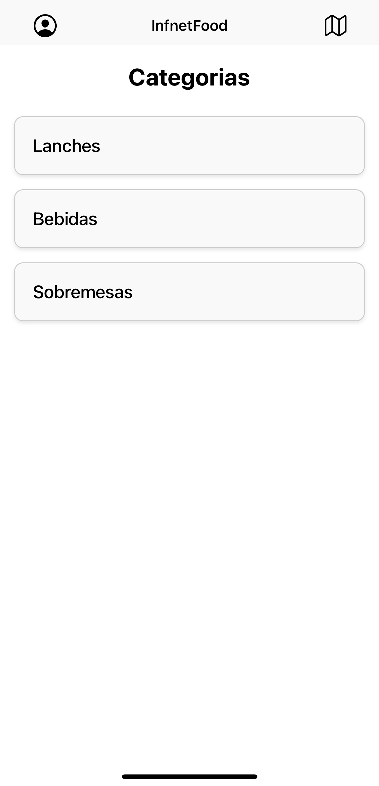
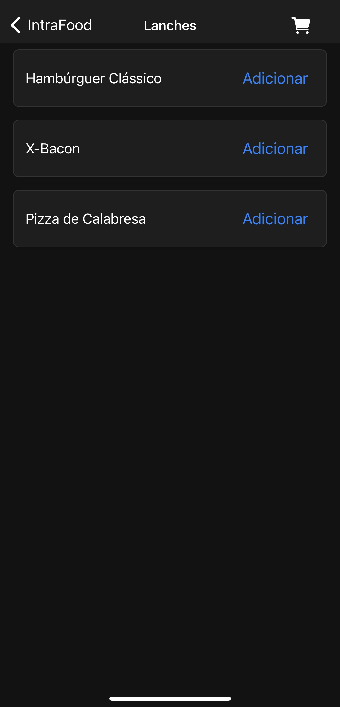
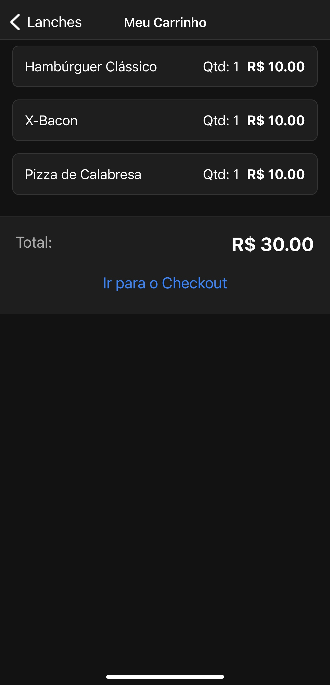
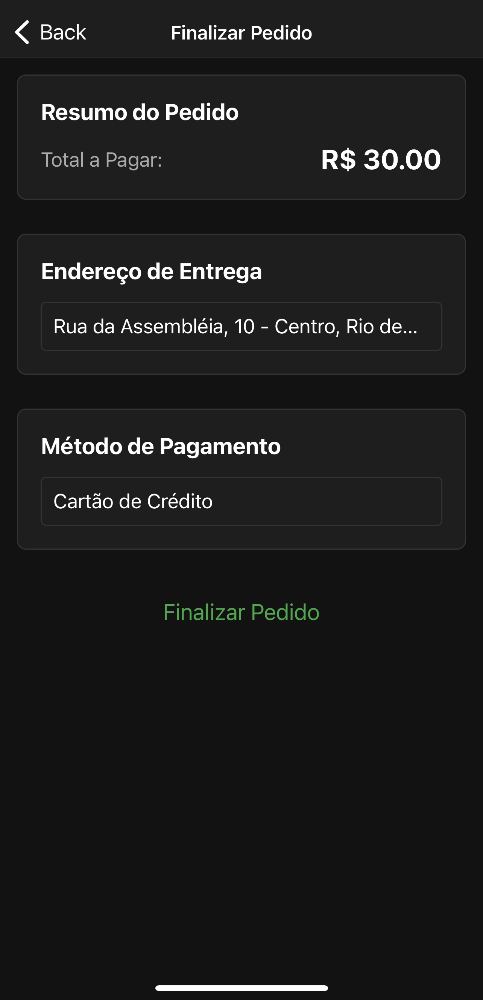
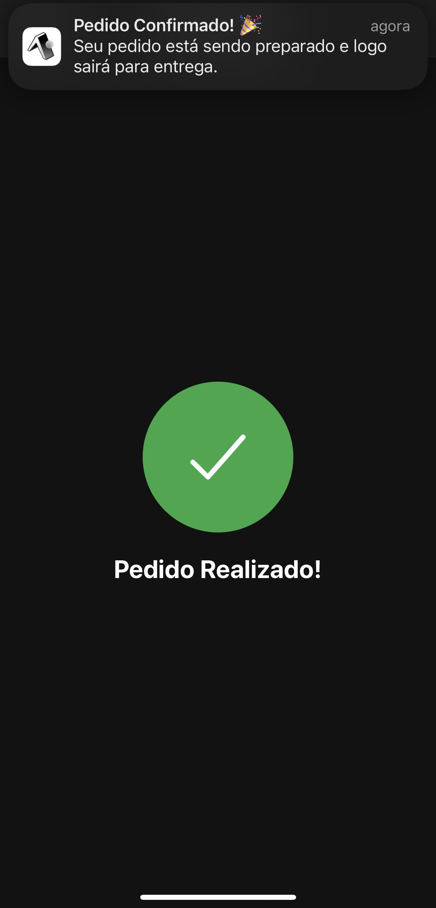
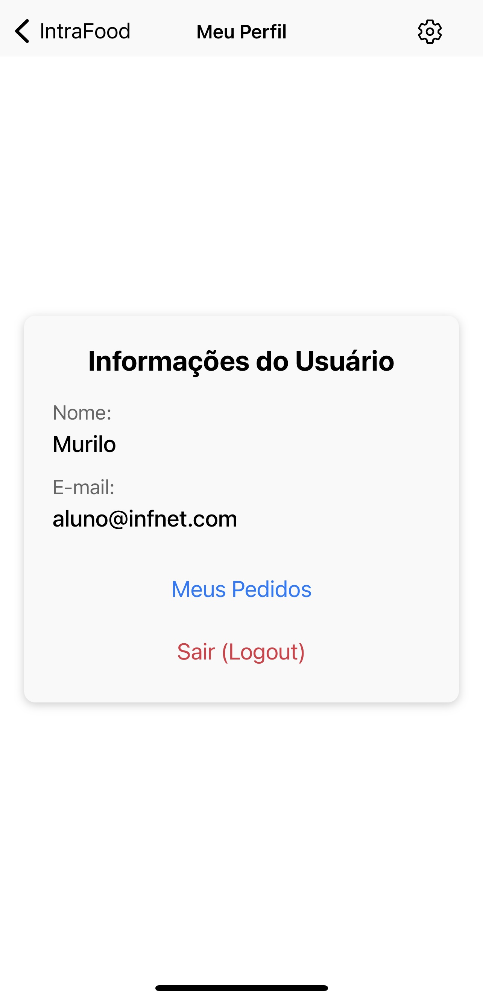
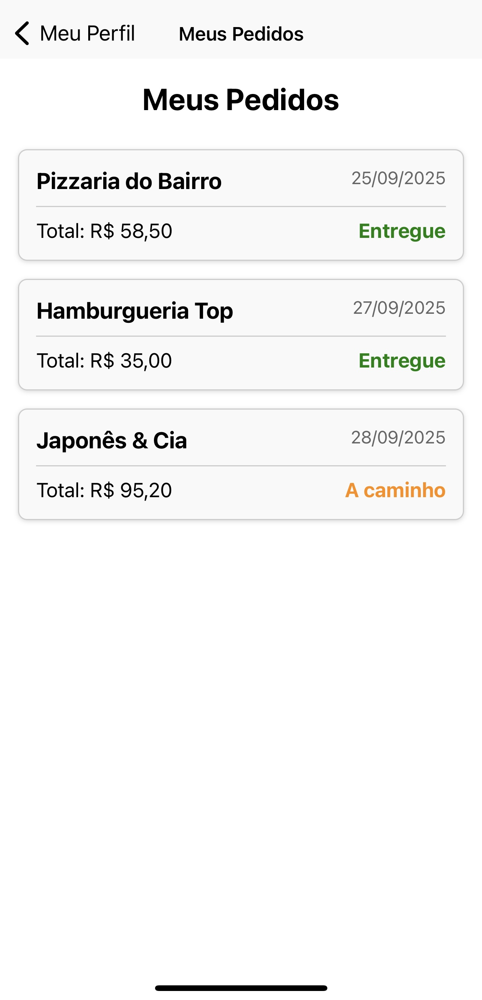

# InfnetFood: App de Pedidos e Delivery 🍔

Projeto de aplicativo de delivery de comida desenvolvido como avaliação para a disciplina de **Desenvolvimento Mobile com React Native** no Bloco de Desenvolvimento Front-end com Frameworks.

---

## 📝 Sobre o Projeto

O **InfnetFood** é um protótipo de aplicativo mobile para pedidos e delivery, criado com **React Native** e **Expo**.  
O foco do projeto foi praticar conceitos da disciplina: navegação, gerenciamento de estado, formulários, tema claro/escuro, animações simples e notificações locais.

---

## ✨ Funcionalidades Implementadas

- [x] **Fluxo de Autenticação:** Rotas públicas (Login) e privadas (App principal).
- [x] **Navegação em Stack:** Entre as telas principais do app.
- [x] **Catálogo de Produtos:** Listagem de categorias e produtos por categoria.
- [x] **Carrinho de Compras:** Adição de itens, quantidades e cálculo de total.
- [x] **Checkout Simulado:** Revisão do pedido com formulário e validação básica.
- [x] **Perfil de Usuário:** Tela com dados mockados e botão de logout.
- [x] **Histórico de Pedidos:** Tela para exibir pedidos anteriores.
- [x] **Mapa Simulado:** Imagem do centro do Rio com 10 restaurantes mockados.
- [x] **Detalhes do Restaurante:** Nome, endereço e sugestão do cardápio.
- [x] **Feedback Visual:** Animações ao adicionar no carrinho e confirmar pedido.
- [x] **Tema Claro/Escuro:** Alternância de tema via Context API.
- [x] **Notificações Locais:** Simulação de notificação de confirmação de pedido.

---

## 🚀 Tecnologias Utilizadas

- **React Native** – framework principal
- **Expo** – execução do app e recursos adicionais
- **React Navigation** – gerenciamento das rotas
- **Expo Notifications** – notificações locais
- **React Context API** – gerenciamento de tema (claro/escuro)
- **React Hooks** – `useState`, `useEffect`, `useContext`, `useRef` e `useLayoutEffect`
- **API Animated** – para pequenas animações nativas

---

## ⚙️ Como Executar o Projeto

Este projeto pode ser executado facilmente no **Expo Snack**, sem precisar instalar dependências localmente.

### Executando no Navegador (Recomendado)

1. Clique no link abaixo para abrir o projeto no Expo Snack:  

   

2. Teste no emulador do **Android** ou **iOS** diretamente no navegador.  
3. Opcionalmente, escaneie o QR Code no **Expo Go** para abrir o app no celular.

---

## 🎨 Algumas Telas do Aplicativo

| Login | Home |
| :---: | :--: |
|  |  |

| Produtos | Carrinho |
| :------: | :------: |
|  |  |

| Checkout | Confirmação de Pedido |
| :------: | :------: |
|  |  |

| Perfil | Histórico de Pedidos |
| :----: | :---------: |
|  |  |

---
